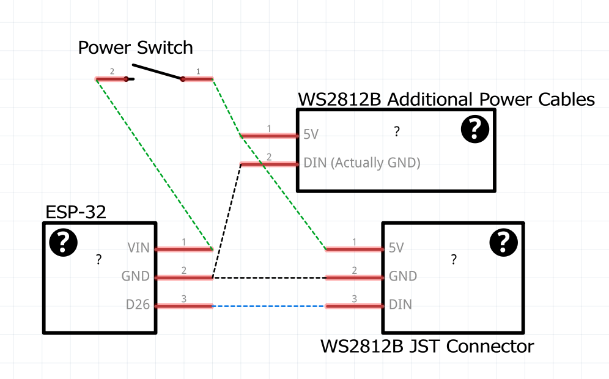

# Blood Glucose Display Matrix

This is a complete project for a 32x8 RGB LED matrix display using an ESP32 microcontroller. The project includes hardware design files for the physical enclosure, assembly instructions, and microcontroller code for driving the display.

## Features

- **Real-Time Blood Glucose Display:** Continuously fetches and displays the latest blood glucose readings from a Nightscout API.
- **LED Matrix Visualization:** Shows readings, delta (change), and a progress bar on a 32x8 WS2812B LED matrix using a modifiable 4x6 pixel font.
- **Color-Coded Alerts:** Readings are color-coded (green, orange, red) to indicate normal, warning, or critical glucose levels.
- **Day/Night Brightness:** Automatically adjusts LED brightness for day and night to reduce glare and save power.
- **Wi-Fi and HTTP Error Handling:** Shows error messages on the display if Wi-Fi or API connection fails.
- **Progress Bar:** Visualizes time since last reading with a dynamic progress bar, adapting its style for day and night.
- **Old Data Warning:** Alerts if the displayed data is outdated.
- **Configurable Settings:** Easily adjust brightness, day/night hours, and data refresh intervals in `Settings.h`.
- **3D Printable Enclosure:** Custom-designed 3D-printable enclosure files to aid in light diffusion.

## Bill of Materials

This project requires access to a 3D printer if you want to create the enclosure, but the display can be used without it.
Unique items. In the "Required" column, "Y" means it is necessary and "N" means it is only needed if you want to build the enclosure. "E" means it is optional but recommended for best results.

| Required | Quantity | Part                                                                | Approx. Price (USD) |
| -------- | -------- | ------------------------------------------------------------------- | ------------------- |
| Y        | 1        | ESP32 Development Board                                             | ~$8                 |
| Y        | 1        | [32x8 WS2812B RGB LED Matrix](https://www.amazon.com/dp/B07P5TSKX8) | ~$15                |
|          |          |                                                                     |                     |
| N        | ~1kg     | PLA or PETG\*                                                       | ~15                 |
| N        | 1        | [Display Power Button](https://www.amazon.com/dp/B0D55TLT1K)        | ~$9/pack            |
| N        | 1        | [USB-C Jack](https://www.amazon.com/dp/B0D17K3CCY)                  | $13                 |
| N        | 1        | [Mylar Sheet\*\*](https://www.amazon.com/dp/B09BJTT6JH)             | ~$17/pack           |

> \* I used RAPID PETG for the enclosure and bowties. I used generic PLA for the other parts. I reccomend a different color of filament for the bowties if you want an accent color.

> \*\*Mylar sheet looks the best, but it can be replaced with any thin light-diffusing material. I have not tried with wax or parchment paper, but it may work. You can also try printing a thin sheet of white or clear PLA (or modifying the "Upper" grid part to have a thin solid layer at the top).

You will also need a breadboard and some jumper wires for wiring this up. A soldering iron is recommended for making more permanent connections. Many makerspaces have these available for very cheap if you do not own them.

## Assembly Instructions

### Software Setup

1. Install [Visual Studio Code](https://code.visualstudio.com/).
1. Install the [PlatformIO IDE extension](https://platformio.org/install/ide?install=vscode).
1. Open the project folder in Visual Studio Code.
1. Create a `Secrets.h` file in the `include` directory using the `ExampleSecrets.h` file as a template.
1. Connect the ESP32 to your computer via USB. If PlatformIO does not automatically detect the serial port, you may need to install the appropriate USB drivers for your ESP32 board. These worked for me:
   - [CP210x USB to UART Bridge VCP Drivers](https://www.silabs.com/software-and-tools/usb-to-uart-bridge-vcp-drivers?tab=downloads)
1. Wire up the ESP32 to the LED matrix as shown in the wiring diagram below. Do not permanently wire the power switch until it is installed in the enclosure. It is recommended to use a connector of some sort so the power switch can be disconnected if needed.
   

   > To connect the JST connector's wires to the breadboard, you should strip them and add dupont connectors.

   > Note that the WS2812B matrix's _middle_ wires are labeled "5V" and "DIN" but **the middle "DIN" wire is actually GND**.

1. Upload the code to the ESP32 using PlatformIO. Use the "Upload and Monitor" option to see serial output for debugging.
1. Once uploaded, the ESP32 should connect to Wi-Fi and start displaying data on the LED matrix. If you encounter any issues, check the serial monitor for error messages.

If this works, continue to the hardware assembly instructions below.

### Hardware Assembly

1. 3D print the enclosure parts using the provided 3mf files in the [print-files](./print-files/) directory:

   | Quantity | Filename           | Notes                                                                                                                                 |
   | -------- | ------------------ | ------------------------------------------------------------------------------------------------------------------------------------- |
   | 1        | `SupportPlate.3mf` | Print in any color. This is entirely internal.                                                                                        |
   | 1        | `Grid.3mf`         | Print the bodies named "Lower" in white; they help with light diffusion. Print the bodies named "Upper" in your main (shell's) color. |
   | 3        | `Bowtie.3mf`       | Highly recommend high infill and an accent color if desired.                                                                          |
   | 1        | `Shell.3mf`        | Recommend high infill. This is the outermost and largest part of the assembly.                                                        |

2. Assemble the enclosure as follows:

- The display power button switch goes in the small hole on the top of the shell. The USB-C port jack goes through the larger hole in the back of the shell. The ESP32 goes loosely inside the shell, so a soldered connection for the wires is recommended.
- The SupportPlate sits behind the LED matrix.
- On top of the LED matrix is the bottom of the grid.
- On top of that is a thin sheet of mylar to help with light diffusion. Cut this to size using the bottom grid piece as a template. It can be slightly smaller than the grid piece, but not larger.
- On top of that is the upper part of the grid. The shell goes around everything, and the bowties hold the shell together.

Finally, the bowties go in the recesses in the shell to hold everything together. The bowties should snap tightly into place. If they are too tight, a small amount of filing or sanding can help.

> A small scraping or filing tool can help manually increase tolerances if needed.

> If the assembly does not fit together, verify that there are no wires blocking closure between the halves. It is possible that the assembly around the matrix is not fitting all the way into the groove at one or both ends of the shell halves. Sometimes a small amount of filing or sanding can help. All components in a half (shell, plate, grid bottom and top) should sit flush with the outer edge of the shell half. Assembly can be tricky. Try getting one half slotted in first, then add the other half.

## Troubleshooting

- If the ESP32 does not connect to Wi-Fi, double-check the SSID and password in `Secrets.h`.
- If the LED matrix does not display anything, ensure that the wiring matches the diagram and that the matrix is powered correctly. Your USB-C cable may not provide enough power; try a different cable or power source.
- If the display is dim or colors are inaccurate, check the brightness settings in `Settings.h`. Brightness below 3 can compromise color accuracy.
